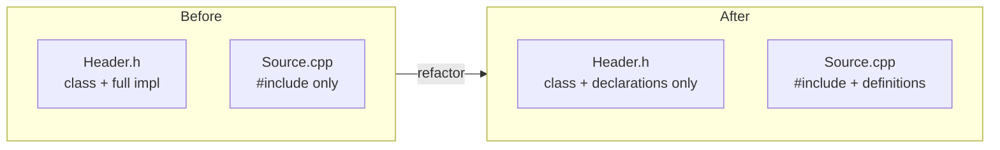
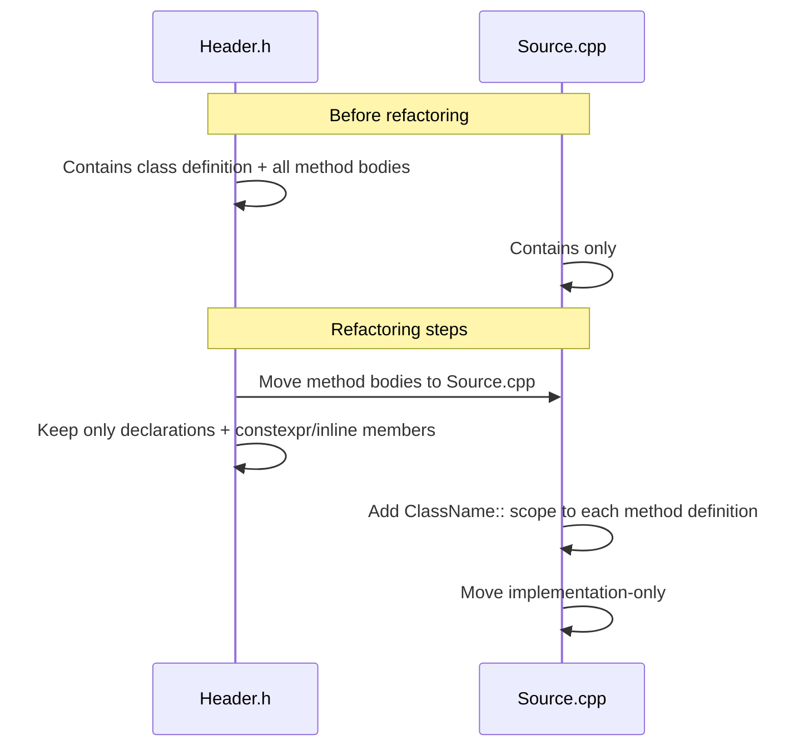

# Design Document: move-impl-to-cpp

## Overview

This refactoring moves all method and function implementations out of C++ header files and into their corresponding `.cpp` files, leaving only class/struct declarations, type definitions, and function signatures in the headers. The goal is to enforce proper separation of interface from implementation, reduce compilation coupling, and follow standard C++ project conventions.

## Architecture

The project currently has 5 header/source pairs where headers contain full implementations. After the refactoring, each pair will follow the canonical C++ pattern: the header declares, the `.cpp` defines.



### Files in Scope

| Header | Source | Key Contents |
|---|---|---|
| `loc.Counter/Counter.h` | `loc.Counter/Counter.cpp` | `Counter` class — constructors, `Count()`, `PrintLanguageBreakdown()`, private helpers |
| `loc.Counter/LineCounter.h` | `loc.Counter/LineCounter.cpp` | `LineCounter` class — `CountLines()`, `StrContains()` |
| `loc.Filesystem/DirectoryScanner.h` | `loc.Filesystem/DirectoryScanner.cpp` | `DirectoryScanner` class — `Scan()`, `to_lower_ascii()`, `normalize_ext()` |
| `loc.Filesystem/ExpandGlob.h` | `loc.Filesystem/ExpandGlob.cpp` | `ExpandGlob` class — `expand_glob()`, `glob_to_regex()`, `is_in_hidden_directory()` |
| `loc.Filesystem/FileReader.h` | `loc.Filesystem/FileReader.cpp` | `FileReader` class — `ReadFile()`, `trim()`, `is_whitespace` |

## Components and Interfaces

### Header File (after refactoring)

Each header retains:
- `#pragma once`
- All `#include` directives needed by the declarations
- The full class definition with member variable declarations
- Method/function **declarations** (signatures only, no bodies)
- `inline` or `constexpr` members that must remain in the header (e.g., `static constexpr` data members)
- Nested types, enums, and structs

```cpp
// Example: FileReader.h after refactoring
#pragma once
#include <string>
#include <vector>
#include <filesystem>
#include <array>

class FileReader
{
public:
    static void ReadFile(const std::filesystem::path& path, std::vector<std::string>& output);

private:
    static std::string_view trim(const std::string& s);
    static constexpr std::array<bool, 256> is_whitespace = []() {
        std::array<bool, 256> arr{};
        arr[' '] = arr['\t'] = arr['\n'] = arr['\r'] = arr['\v'] = arr['\f'] = true;
        return arr;
    }();
};
```

### Source File (after refactoring)

Each `.cpp` file contains:
- `#include "ClassName.h"` (and any additional includes needed only by the implementation)
- Full definitions of all methods, with `ClassName::` scope qualifier

```cpp
// Example: FileReader.cpp after refactoring
#include "FileReader.h"
#include <iostream>
#include <fstream>

void FileReader::ReadFile(const std::filesystem::path& path, std::vector<std::string>& output)
{
    // ... full implementation ...
}

std::string_view FileReader::trim(const std::string& s)
{
    // ... full implementation ...
}
```

## Data Models

### Special Cases to Handle

#### `static constexpr` array in `FileReader`

`is_whitespace` is a `static constexpr std::array<bool, 256>` initialized with a lambda. In C++17 and later, `static constexpr` members can be defined inline in the class body in the header — this one **stays in the header**.

#### `static constexpr const char*[]` in `DirectoryScanner`

`supported_extensions` is a `static constexpr` array of string literals. It must remain in the header as an inline `constexpr` definition.

#### `comma_numpunct` nested struct in `Counter`

This is a private nested struct used only inside `Counter`. It stays in the header as part of the class definition, but its `do_grouping()` and `do_thousands_sep()` overrides can be moved to the `.cpp` if desired, or kept inline since they are trivial one-liners. For simplicity, the nested struct definition (including its short method bodies) stays in the header.

#### `FILE_LANGUAGE` enum in `Counter`

Private enum class — stays in the header as part of the class definition.

#### `inline` helper methods in `DirectoryScanner`

`to_lower_ascii()` and `normalize_ext()` are currently marked `inline`. After moving to `.cpp`, the `inline` keyword is removed (it is only meaningful in headers for ODR purposes). The methods become regular private member functions defined in the `.cpp`.

## Sequence Diagrams

### Refactoring Workflow per File Pair



## Key Functions with Formal Specifications

### Rule: What stays in the header

**Preconditions:**
- Member is part of the class interface (public or protected) OR is a type/enum/nested struct needed by the interface
- OR member is `constexpr`/`inline` and must be visible at the call site for the compiler

**Postconditions:**
- Header contains no function bodies except for `constexpr` and trivially-inline members
- All `#include` directives needed only by implementation details are removed from the header

### Rule: What moves to the `.cpp`

**Preconditions:**
- Member is a non-`constexpr`, non-`inline` method or function with a body in the header

**Postconditions:**
- Method body appears in `.cpp` with `ClassName::methodName(params)` signature
- `inline` keyword is removed from the definition in `.cpp`
- Any `#include` that was only needed by the implementation is moved to `.cpp`

## Error Handling

### ODR (One Definition Rule) Violations

**Condition**: A non-inline function definition remains in a header included by multiple translation units.  
**Response**: Linker error — "multiple definition of ...".  
**Prevention**: Ensure all non-`constexpr`/non-`inline` method bodies are moved to `.cpp`.

### Missing `#include` in `.cpp`

**Condition**: An implementation-only type (e.g., `<fstream>`, `<iostream>`) is removed from the header but not added to the `.cpp`.  
**Response**: Compile error in the `.cpp` file.  
**Prevention**: Audit each moved method for its include dependencies and add them to the `.cpp`.

### Forward Declaration Gaps

**Condition**: A type used only in method bodies was previously pulled in transitively via the header.  
**Response**: Compile error in files that relied on the transitive include.  
**Prevention**: Headers should include only what they need for declarations; `.cpp` files include what they need for definitions.

## Testing Strategy

### Verification Approach

Since this is a pure refactoring (no behavioral change), the existing test suite is the primary correctness oracle.

**Build verification**: The project must compile without errors or warnings after each file pair is refactored.

**Test suite**: All existing tests in `loc.tests/` must pass unchanged:
- `Test_Counter.cpp`
- `Test_CLineCounter.cpp`, `Test_FSLineCounter.cpp`, `Test_PyLineCounter.cpp`, `Test_XmlLineCounter.cpp`
- `Test_DirectoryScanner.cpp`
- `Test_ExpandGlob.cpp`

**Incremental approach**: Refactor and verify one file pair at a time to isolate any issues.

### Property-Based Testing Approach

Not applicable for this refactoring — the transformation is structural, not algorithmic. Correctness is verified by compilation success and existing unit test passage.

## Performance Considerations

Moving implementations to `.cpp` files improves incremental build times: changes to a method body no longer force recompilation of every translation unit that includes the header. This is a net positive with no runtime performance impact.

## Security Considerations

No security implications. This is a structural source reorganization with no changes to logic, data handling, or external interfaces.

## Dependencies

No new dependencies are introduced. The refactoring uses only the existing standard library headers already present in the project (`<filesystem>`, `<string>`, `<vector>`, `<regex>`, `<fstream>`, `<iostream>`, `<thread>`, `<atomic>`, `<mutex>`, `<map>`, etc.).

## Correctness Properties

*A property is a characteristic or behavior that should hold true across all valid executions of a system — essentially, a formal statement about what the system should do. Properties serve as the bridge between human-readable specifications and machine-verifiable correctness guarantees.*

### Property 1: Headers contain no non-constexpr function bodies

*For any* header file in scope after the refactoring, the file should contain no function or method body except for `constexpr` members and the explicitly retained nested struct (`comma_numpunct`).

**Validates: Requirements 1.1, 1.4, 1.5**

### Property 2: Source files contain ClassName::-qualified definitions for all moved methods

*For any* non-`constexpr` method that previously had a body in a header, the corresponding `.cpp` file should contain a definition of that method prefixed with the `ClassName::` scope qualifier.

**Validates: Requirements 2.1, 2.2**

### Property 3: No `inline` keyword in `.cpp` definitions

*For any* method definition in a `.cpp` file, the definition should not carry the `inline` keyword, regardless of whether the method was `inline` in the original header.

**Validates: Requirements 2.3, 3.5**

### Property 4: Implementation-only includes absent from headers

*For any* `#include` directive that is only required by a method body (e.g., `<fstream>`, `<iostream>`), that directive should not appear in the header file after the refactoring.

**Validates: Requirements 1.6, 2.4**

### Property 5: Build and test suite pass after each file pair

*For any* intermediate state where exactly N file pairs have been refactored (N = 1..5), the project should compile without errors and all tests in `loc.tests/` should pass.

**Validates: Requirements 4.1, 4.2, 4.4, 5.1, 5.2, 5.3, 5.4, 5.5, 5.6, 5.7, 6.2**
