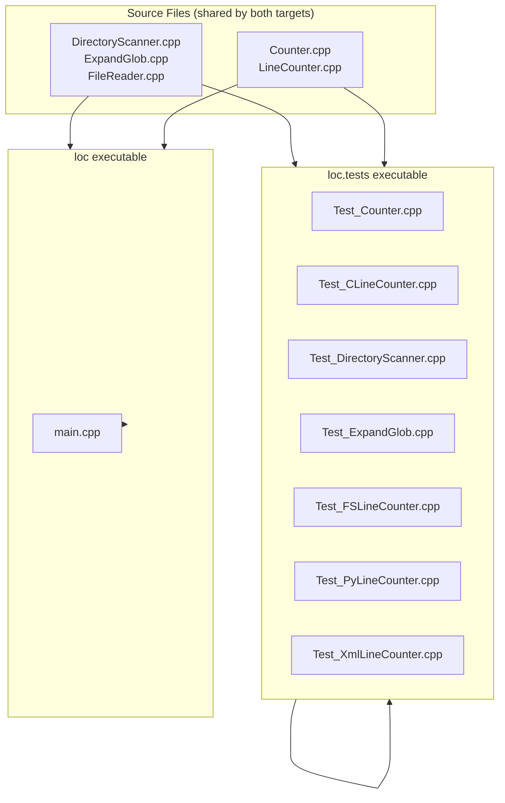
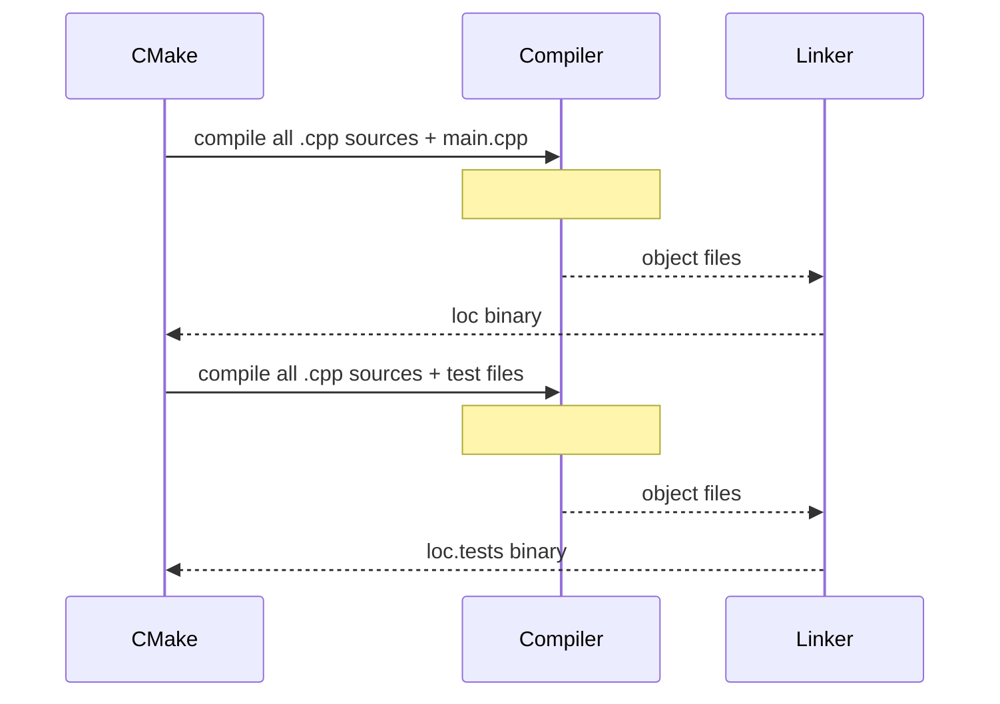

# Design Document: remove-cpp-modules

## Overview

This refactor converts the `loc` project from C++20 named modules (`.ixx` files using `export module` / `import` syntax) to the traditional header + source file model (`.h` / `.cpp`). The goal is to improve toolchain compatibility, IDE support, and build-system simplicity while preserving all existing behaviour and test coverage.

The project currently has two library targets (`loc.Filesystem` and `loc.Counter`) and one executable (`loc`), plus a Catch2 test suite. After the refactor, the separate library targets are **removed entirely**. All `.cpp` source files are compiled directly into the `loc` executable and also directly into the `loc.tests` test executable — there are no intermediate static libraries.

---

## Architecture



---

## Sequence Diagrams

### Build flow (after refactor)



---

## Components and Interfaces

### loc.Filesystem sources

All three classes are currently defined entirely inside their `.ixx` files (header-only style). After the refactor the class definitions move to `.h` files; since all methods are currently inline/defined in the module unit, the `.cpp` files will be minimal (just `#include` the header to satisfy the build system, or hold any non-inline implementations if they are extracted). There is no umbrella `loc.Filesystem.h` — consumers include individual headers directly.

#### DirectoryScanner

**File**: `loc/src/loc.Filesystem/DirectoryScanner.h` + `DirectoryScanner.cpp`

```cpp
// DirectoryScanner.h
#pragma once
#include <filesystem>
#include <vector>
#include <string>

class DirectoryScanner {
public:
    DirectoryScanner() = default;

    std::vector<std::filesystem::path> Scan(
        const std::filesystem::path& root,
        const std::vector<std::filesystem::path>& ignore_dir_names = {},
        bool case_insensitive = true,
        bool follow_directory_symlinks = false,
        size_t reserve_result = 0);

private:
    std::string to_lower_ascii(std::string_view s);
    std::string normalize_ext(std::string_view ext, bool case_insensitive);

    static constexpr const char* supported_extensions[];
};
```

#### ExpandGlob

**File**: `loc/src/loc.Filesystem/ExpandGlob.h` + `ExpandGlob.cpp`

```cpp
// ExpandGlob.h
#pragma once
#include <filesystem>
#include <vector>
#include <regex>

class ExpandGlob {
public:
    void expand_glob(const std::filesystem::path& pattern,
                     std::vector<std::filesystem::path>& out) const;

private:
    std::regex glob_to_regex(const std::string& glob) const;
    bool is_in_hidden_directory(const std::filesystem::path& path) const;
};
```

#### FileReader

**File**: `loc/src/loc.Filesystem/FileReader.h` + `FileReader.cpp`

```cpp
// FileReader.h
#pragma once
#include <filesystem>
#include <vector>
#include <string>
#include <array>

class FileReader {
public:
    static void ReadFile(const std::filesystem::path& path,
                         std::vector<std::string>& output);

private:
    static std::string_view trim(const std::string& s);
    static constexpr std::array<bool, 256> is_whitespace = /* ... */;
};
```

No umbrella `loc.Filesystem.h` is created. Consumers include whichever individual header(s) they need.

---

### loc.Counter sources

#### LineCounter

**File**: `loc/src/loc.Counter/LineCounter.h` + `LineCounter.cpp`

```cpp
// LineCounter.h
#pragma once
#include <filesystem>
#include <string>
#include "loc.Filesystem/FileReader.h"

class LineCounter {
public:
    unsigned long CountLines(const std::filesystem::path& path,
                             const std::string& inlineComment,
                             const std::string& startMultilineComment,
                             const std::string& endMultilineComment);

private:
    bool StrContains(const std::string& str, const std::string& substr);
};
```

#### Counter

**File**: `loc/src/loc.Counter/Counter.h` + `Counter.cpp`

```cpp
// Counter.h
#pragma once
#include <filesystem>
#include <vector>
#include <atomic>
#include <mutex>
#include <map>
#include "loc.Filesystem/DirectoryScanner.h"
#include "loc.Filesystem/ExpandGlob.h"
#include "loc.Counter/LineCounter.h"

class Counter {
public:
    Counter(unsigned int jobs,
            const std::vector<std::filesystem::path>& paths);

    Counter(unsigned int jobs,
            const std::vector<std::filesystem::path>& directoryPaths,
            const std::vector<std::filesystem::path>& filePaths,
            bool includeGenerated,
            const std::vector<std::filesystem::path>& ignoreDirs);

    unsigned long Count();
    void PrintLanguageBreakdown() const;

private:
    // ... (private members unchanged)
};
```

No umbrella `loc.Counter.h` is created. Consumers include whichever individual header(s) they need.

---

## Data Models

No data model changes. All types (`FILE_LANGUAGE` enum, `comma_numpunct` struct) remain internal to `Counter`.

---

## CMake Update Strategy

The key architectural change is the **removal of the `loc.Filesystem` and `loc.Counter` static library targets**. Instead, both the `loc` executable and the `loc.tests` executable compile all source files directly.

### loc/CMakeLists.txt (after)

```cmake
cmake_minimum_required(VERSION 3.14)
project(loc LANGUAGES CXX)

set(CMAKE_CXX_STANDARD 20)
set(CMAKE_CXX_STANDARD_REQUIRED ON)

find_package(CLI11 CONFIG REQUIRED)

set(LOC_SOURCES
    src/loc.Filesystem/DirectoryScanner.cpp
    src/loc.Filesystem/ExpandGlob.cpp
    src/loc.Filesystem/FileReader.cpp
    src/loc.Counter/Counter.cpp
    src/loc.Counter/LineCounter.cpp
)

add_executable(loc src/main.cpp ${LOC_SOURCES})
target_include_directories(loc PRIVATE src)
target_link_libraries(loc PRIVATE CLI11::CLI11)
```

### loc.tests/CMakeLists.txt (after)

```cmake
find_package(Catch2 3 REQUIRED)

set(LOC_SOURCES
    ../loc/src/loc.Filesystem/DirectoryScanner.cpp
    ../loc/src/loc.Filesystem/ExpandGlob.cpp
    ../loc/src/loc.Filesystem/FileReader.cpp
    ../loc/src/loc.Counter/Counter.cpp
    ../loc/src/loc.Counter/LineCounter.cpp
)

add_executable(loc.tests
    main.cpp
    Test_Counter.cpp
    Test_CLineCounter.cpp
    Test_DirectoryScanner.cpp
    Test_ExpandGlob.cpp
    Test_FSLineCounter.cpp
    Test_PyLineCounter.cpp
    Test_XmlLineCounter.cpp
    ${LOC_SOURCES}
)

target_include_directories(loc.tests PRIVATE ../loc/src)
target_link_libraries(loc.tests PRIVATE Catch2::Catch2WithMain)
```

Note: `loc.tests` no longer links against `loc.Filesystem` or `loc.Counter` — those targets no longer exist. It compiles the same `.cpp` files directly and uses `target_include_directories` to resolve headers.

---

## Key Functions with Formal Specifications

### FileReader::ReadFile

```cpp
static void ReadFile(const std::filesystem::path& path,
                     std::vector<std::string>& output);
```

**Preconditions:**
- `path` refers to a readable regular file on disk
- `output` is a valid (possibly non-empty) vector

**Postconditions:**
- Each element of `output` is a non-empty, whitespace-trimmed line from the file
- If the file cannot be opened, `output` is unchanged and a message is written to `stderr`
- No exceptions are thrown

### LineCounter::CountLines

```cpp
unsigned long CountLines(const std::filesystem::path& path,
                         const std::string& inlineComment,
                         const std::string& startMultilineComment,
                         const std::string& endMultilineComment);
```

**Preconditions:**
- `path` is a readable file
- Comment marker strings are either empty (disabled) or valid non-overlapping tokens

**Postconditions:**
- Returns the number of non-blank, non-comment lines
- Multiline comment state does not leak between calls (stateless per call)

**Loop Invariants:**
- `InMultiLineComment` correctly reflects whether the parser is inside a block comment at the start of each character iteration

### Counter::Count

```cpp
unsigned long Count();
```

**Preconditions:**
- Internal `paths` vector is populated (via constructor)
- `jobs >= 1`

**Postconditions:**
- Returns the sum of `CountFile()` results across all paths
- `total_lines` equals the returned value
- `language_line_counts` is fully populated

**Loop Invariants (worker threads):**
- `next_index` monotonically increases; each file is processed exactly once

---

## Algorithmic Pseudocode

### Header inclusion strategy

```pascal
ALGORITHM resolve_includes(source_file)
INPUT: source_file (.cpp or test file)
OUTPUT: correct #include directives

BEGIN
  IF source_file is LineCounter.h THEN
    #include "loc.Filesystem/FileReader.h"
  ELSE IF source_file is Counter.h THEN
    #include "loc.Filesystem/DirectoryScanner.h"
    #include "loc.Filesystem/ExpandGlob.h"
    #include "loc.Counter/LineCounter.h"
  ELSE IF source_file is main.cpp THEN
    #include "loc.Counter/Counter.h"
  ELSE IF source_file is Test_Counter.cpp
       OR Test_CLineCounter.cpp
       OR Test_FSLineCounter.cpp
       OR Test_PyLineCounter.cpp
       OR Test_XmlLineCounter.cpp THEN
    #include "loc.Counter/Counter.h"
  ELSE IF source_file is Test_DirectoryScanner.cpp THEN
    #include "loc.Filesystem/DirectoryScanner.h"
  ELSE IF source_file is Test_ExpandGlob.cpp THEN
    #include "loc.Filesystem/ExpandGlob.h"
  END IF
END
```

### CMake target update

```pascal
ALGORITHM update_cmake(loc_dir, tests_dir)

BEGIN
  // loc/CMakeLists.txt
  REMOVE add_library(loc.Filesystem ...) block
  REMOVE add_library(loc.Counter ...) block
  DEFINE LOC_SOURCES = [all .cpp files from loc.Filesystem and loc.Counter]
  CHANGE add_executable(loc ...) to include LOC_SOURCES
  ADD target_include_directories(loc PRIVATE src)
  REMOVE target_link_libraries references to loc.Filesystem and loc.Counter

  // loc.tests/CMakeLists.txt
  REMOVE experimental module compiler option blocks
  DEFINE LOC_SOURCES = [same .cpp files, relative to tests dir]
  ADD LOC_SOURCES to add_executable(loc.tests ...)
  ADD target_include_directories(loc.tests PRIVATE ../loc/src)
  REMOVE target_link_libraries references to loc.Filesystem and loc.Counter
END
```

---

## Error Handling

### Scenario 1: Missing include path

**Condition**: A `.cpp` or test file cannot find a header after the refactor.
**Response**: Compiler error at build time — caught immediately.
**Recovery**: Ensure `target_include_directories` points to `src/` (for `loc`) or `../loc/src/` (for `loc.tests`) so that `#include "loc.Counter/Counter.h"` and `#include "loc.Filesystem/DirectoryScanner.h"` (etc.) resolve correctly.

### Scenario 2: ODR (One Definition Rule) violations

**Condition**: A class definition appears in both a `.h` and a `.cpp` (e.g., inline methods duplicated).
**Response**: Linker error or undefined behaviour.
**Recovery**: Keep full method bodies in `.h` (inline) or move them exclusively to `.cpp` with only declarations in `.h`. The current codebase defines all methods inline in the module units, so keeping them inline in the headers is the simplest approach.

### Scenario 3: Circular includes

**Condition**: `Counter.h` includes `FileReader.h` which somehow includes `Counter.h`.
**Response**: Compile error.
**Recovery**: The dependency is strictly one-way: `Counter.h` → `loc.Filesystem/DirectoryScanner.h`, `loc.Filesystem/ExpandGlob.h`, `loc.Counter/LineCounter.h` → `loc.Filesystem/FileReader.h`. Use `#pragma once` on every header.

### Scenario 4: Duplicate symbol errors from compiling sources twice

**Condition**: The same `.cpp` file is compiled into both `loc` and `loc.tests`, causing linker errors if any symbols are defined in headers without `inline`.
**Response**: Linker error (multiple definition).
**Recovery**: Ensure all function/method definitions in `.h` files are marked `inline`, or move implementations to `.cpp` files so each translation unit has its own copy.

---

## Testing Strategy

### Unit Testing Approach

All existing Catch2 tests are preserved. The only changes are:
1. Replacing `import loc.Counter;` / `import loc.Filesystem;` with the corresponding `#include` directives.
2. The test CMake target compiles the source `.cpp` files directly instead of linking against library targets.

| Test file | Current import | New include |
|---|---|---|
| Test_Counter.cpp | `import loc.Counter;` | `#include "loc.Counter/Counter.h"` |
| Test_CLineCounter.cpp | `import loc.Counter;` | `#include "loc.Counter/Counter.h"` |
| Test_DirectoryScanner.cpp | `import loc.Filesystem;` | `#include "loc.Filesystem/DirectoryScanner.h"` |
| Test_ExpandGlob.cpp | `import loc.Filesystem;` | `#include "loc.Filesystem/ExpandGlob.h"` |
| Test_FSLineCounter.cpp | `import loc.Counter;` | `#include "loc.Counter/Counter.h"` |
| Test_PyLineCounter.cpp | `import loc.Counter;` | `#include "loc.Counter/Counter.h"` |
| Test_XmlLineCounter.cpp | `import loc.Counter;` | `#include "loc.Counter/Counter.h"` |

### Property-Based Testing Approach

Not applicable for this structural refactor — correctness is validated by the existing test suite passing unchanged.

### Integration Testing Approach

Build the full project (`cmake --build`) and run `ctest` after the refactor. All existing tests must pass with identical results.

---

## Performance Considerations

None. This is a pure structural refactor. Runtime behaviour is identical; the compiler may inline slightly differently but no performance regression is expected.

---

## Security Considerations

None introduced by this refactor.

---

## Dependencies

| Dependency | Role | Change? |
|---|---|---|
| CMake ≥ 3.28 | Build system | Minimum version can be relaxed to 3.14 after removing `FILE_SET CXX_MODULES` |
| CLI11 | CLI argument parsing (main.cpp) | No change |
| Catch2 v3 | Test framework | No change |
| vcpkg | Package manager | No change |
| C++20 standard | Language standard | Still required (uses `std::jthread`, `std::atomic`, ranges, etc.) |
